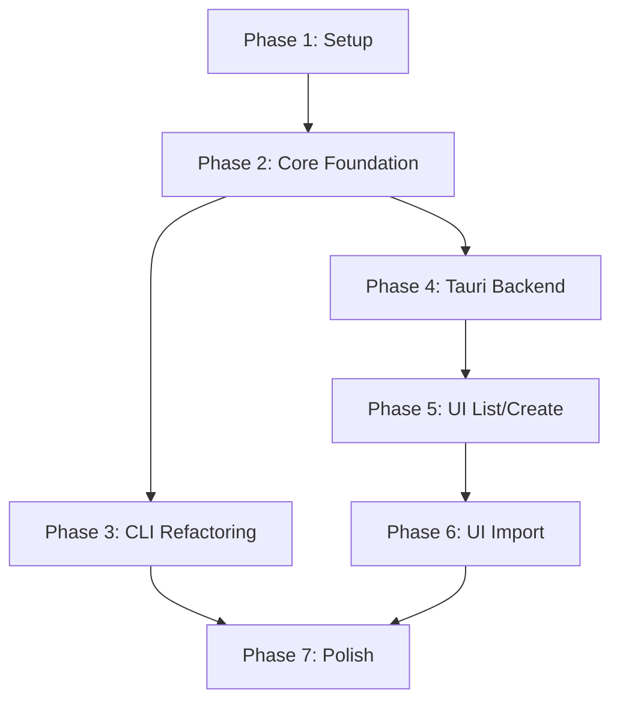

# Tasks: Core Library Foundation

**Input**: Design documents from `/specs/001-core-library-foundation/`
**Prerequisites**: plan.md ✓, spec.md ✓

**Organization**: Tasks are grouped by phase to enable systematic refactoring. P1 stories (CLI) must work before P2/P3 (UI).

## Format: `[ID] [P?] [Story?] Description`

- **[P]**: Can run in parallel (different files, no dependencies)
- **[Story]**: Which user story this task belongs to (US1-US6)
- Include exact file paths in descriptions

## Phase 1: Setup & Project Structure

**Purpose**: Create Cargo workspace structure and initialize crates

- [X] T001 Create Cargo workspace in root Cargo.toml with members: crates/nut-core, crates/nut-cli
- [X] T002 [P] Initialize crates/nut-core crate with Cargo.toml (dependencies: tokio, ulid, serde, thiserror, directories, config, octocrab, walkdir)
- [X] T003 [P] Initialize crates/nut-cli crate with Cargo.toml (dependencies: nut-core, clap, miette, tokio)
- [X] T004 [P] Create crates/nut-core/src/lib.rs with public module declarations
- [X] T005 [P] Create crates/nut-core/tests/ directory for integration tests

---

## Phase 2: Core Library Foundation (Blocking Prerequisites)

**Purpose**: Move workspace, config, dirs, git, gh, and error code to core library. This MUST be complete before CLI refactoring.

⚠️ **CRITICAL**: No user story work can begin until core library is functional

### Move Config & Directory Operations

- [X] T006 [P] Move src/config.rs to crates/nut-core/src/config.rs with NutConfig struct
- [X] T007 [P] Move src/dirs.rs to crates/nut-core/src/dirs.rs (get_data_local_dir, get_cache_dir functions)
- [X] T008 Update crates/nut-core/src/dirs.rs to use config::NutConfig from same crate

### Move Error Types

- [X] T009 Move src/error.rs to crates/nut-core/src/error.rs (all NutError variants needed by core)

### Move Git Operations

- [X] T010 Move src/git.rs to crates/nut-core/src/git.rs (clone, get_all_repos_status functions only; apply_command stays CLI-only)
- [X] T011 Update crates/nut-core/src/git.rs imports to use local error and dirs modules

### Move GitHub Integration

- [X] T012 Move src/gh.rs to crates/nut-core/src/gh.rs (GitProtocol, get_auth_token, get_git_protocol, and fallback functions)

### Move Workspace Operations

- [X] T013 Move Workspace struct from src/workspace.rs to crates/nut-core/src/workspace.rs
- [X] T014 Add workspace creation function to crates/nut-core/src/workspace.rs: create_workspace(description: String) -> Result<Workspace>
- [X] T015 Add workspace listing function to crates/nut-core/src/workspace.rs: list_workspaces() -> Result<Vec<WorkspaceInfo>>
- [X] T016 Add WorkspaceInfo struct in crates/nut-core/src/workspace.rs (id, created_at, description, path)

### Core Library API

- [X] T017 Export public API from crates/nut-core/src/lib.rs (workspace, config, dirs, git, gh, error modules)
- [X] T018 Add integration test in crates/nut-core/tests/workspace_tests.rs for create and list operations

**Checkpoint**: Core library compiles and tests pass - CLI refactoring can now begin

---

## Phase 3: CLI Refactoring (User Stories 1-3, Priority P1)

**Goal**: Refactor CLI to use core library. Existing behavior must be unchanged.

**Independent Test**: Run existing integration tests - all must pass

### Setup CLI Crate

- [X] T019 [US1-3] Copy src/main.rs to crates/nut-cli/src/main.rs
- [X] T020 [US1-3] Copy src/enter.rs to crates/nut-cli/src/enter.rs (CLI-only functionality)
- [X] T021 [US1-3] Update crates/nut-cli imports to use nut_core crate

### User Story 1: Create Workspace via CLI

- [X] T022 [US1] Update Create command in crates/nut-cli/src/main.rs to call nut_core::workspace::create_workspace()
- [X] T023 [US1] Update Create command in crates/nut-cli/src/main.rs to check if already in workspace (move workspace detection to core), then call enter from CLI after creation
- [ ] T024 [US1] Test: Run `nut create -d "test"` and verify workspace created with ULID directory

### User Story 2: List Workspaces via CLI

- [X] T025 [US2] Update List command in crates/nut-cli/src/main.rs to call nut_core::workspace::list_workspaces()
- [X] T026 [US2] Preserve exact output format: ULID, "Created: YYYY-MM-DD HH:MM:SS", description
- [ ] T027 [US2] Test: Run `nut list` and verify output matches previous behavior (sorted by creation, most recent first)

### User Story 3: Import Repositories via CLI

- [X] T028 [US3] Update Import command in crates/nut-cli/src/main.rs to use nut_core::git and nut_core::gh functions
- [ ] T029 [US3] Test: Run `nut import owner/repo` and verify repository cloned
- [ ] T030 [US3] Test: Run `nut import -q "owner:test"` and verify search query works
- [ ] T031 [US3] Test: Run `nut import --dry-run owner/repo` and verify no cloning occurs

### CLI Integration  Tests

- [X] T032 [US1-3] Run existing tests/integration_tests.rs and verify all pass
- [ ] T032b [US1-3] Compare CLI output byte-for-byte before/after refactoring for create, list, and import commands
- [ ] T033 [US1-3] Update Cargo.toml [[bin]] section to point to crates/nut-cli/src/main.rs
- [ ] T034 [US1-3] Remove old src/ directory after verifying CLI works

**Checkpoint**: CLI refactored and working - ready for Tauri integration

---

## Phase 4: Tauri Backend & Type Generation (Foundational for UI)

**Purpose**: Setup Tauri app structure and type-safe command layer

⚠️ **CRITICAL**: Type generation must work before UI stories can proceed

### Tauri Initialization

- [X] T035 Initialize Tauri project in src-tauri/ directory (Tauri 2.x)
- [X] T036 [P] Add nut-core dependency to src-tauri/Cargo.toml
- [X] T037 [P] Add specta and tauri-specta dependencies to src-tauri/Cargo.toml for type generation

### Type Definitions

- [X] T038 [P] Create crates/nut-core/src/types.rs with TypeScript-exportable types (derive Serialize, Deserialize, specta::Type)
- [X] T039 [P] Define WorkspaceInfo struct in crates/nut-core/src/types.rs (id: String, description: String, created_at: String, path: String)
- [X] T040 [P] Define CreateWorkspaceRequest struct: { description: String }
- [X] T041 [P] Define ImportRequest struct: { workspace_id: String, query: Option<String>, repository_names: Vec<String>, dry_run: bool }

### Tauri Commands

- [X] T042 Create src-tauri/src/commands.rs with command function signatures
- [X] T043 [P] Implement list_workspaces command in src-tauri/src/commands.rs calling nut_core::workspace::list_workspaces()
- [X] T044 [P] Implement create_workspace command in src-tauri/src/commands.rs calling nut_core::workspace::create_workspace()
- [X] T045 Implement import_repositories command in src-tauri/src/commands.rs (async, returns progress stream)
- [X] T046 Register commands in src-tauri/src/main.rs
- [X] T047 Configure Tauri capabilities in src-tauri/capabilities/workspace-access.json (fs:read-dir, fs:create-dir, fs:write-file scoped to workspace dirs from config) - NOTE: These permissions are for Tauri backend commands accessing core library, NOT for frontend direct filesystem access

### Type Generation

- [X] T048 Setup specta type generation script in src-tauri/src/main.rs (generate types to user-interface/src/bindings/types.ts)
- [X] T049 Generate TypeScript types and verify user-interface/src/bindings/types.ts created (not committed, build-time only)
- [X] T050 Add type generation to build process (build.rs or npm script)
- [X] T050b [P] Add user-interface/src/bindings/ to .gitignore to exclude generated types from version control

**Checkpoint**: Tauri backend ready, types generated - UI work can begin

---

## Phase 5: Desktop UI - List & Create (User Stories 4-5, Priority P2)

**Goal**: Implement workspace list and create in desktop UI

**Independent Test**: Launch Tauri app, list workspaces, create new workspace

### User Story 4: List Workspaces in Desktop UI

- [ ] T051 [US4] Create user-interface/src/services/tauriWorkspaceService.ts importing generated types
- [ ] T052 [US4] Implement getWorkspaces() in tauriWorkspaceService.ts using invoke('list_workspaces')
- [ ] T053 [US4] Update user-interface/src/App.tsx to use tauriWorkspaceService.getWorkspaces()
- [ ] T054 [US4] Test: Launch app and verify workspaces appear in sidebar matching CLI `nut list` output

### User Story 5: Create Workspace in Desktop UI

- [ ] T055 [US5] Implement createWorkspace(description) in tauriWorkspaceService.ts using invoke('create_workspace')
- [ ] T056 [US5] Update CreateWorkspaceDialog.tsx to call tauriWorkspaceService.createWorkspace()
- [ ] T057 [US5] Add error handling to CreateWorkspaceDialog.tsx for failed creation
- [ ] T058 [US5] Test: Click create, enter description, verify workspace appears

**Checkpoint**: Users can list and create workspaces in desktop UI

---

## Phase 6: Desktop UI - Import Repositories (User Story 6, Priority P3)

**Goal**: Implement repository import in desktop UI with progress feedback

**Independent Test**: Select workspace, enter query, click import, verify repositories appear

### User Story 6: Import Repositories in Desktop UI

- [ ] T059 [US6] Implement importRepositories(request) in tauriWorkspaceService.ts using invoke('import_repositories')
- [ ] T060 [US6] Setup progress event listener in tauriWorkspaceService.ts for import progress
- [ ] T061 [US6] Update ImportDialog.tsx to call tauriWorkspaceService.importRepositories()
- [ ] T062 [US6] Add progress display to ImportDialog.tsx showing repository names as they're cloned
- [ ] T063 [US6] Add error handling for individual repository failures
- [ ] T064 [US6] Implement dry-run checkbox in ImportDialog.tsx
- [ ] T065 [US6] Test: Enter query, click import, verify repositories cloned and appear in UI

**Checkpoint**: Full create/list/import workflow works end-to-end in desktop UI

---

## Phase 7: Polish & Documentation

**Purpose**: Finalize implementation, documentation, and validation

- [ ] T066 [P] Update README.md with Tauri desktop app installation instructions
- [ ] T067 [P] Update TUTORIALS.md with desktop UI workflows
- [ ] T068 Verify all constitution principles are met (Core-First ✓, Type Safety ✓, Security ✓, Simplicity ✓, Performance ✓)
- [ ] T069 Run full test suite: cargo test --workspace
- [ ] T070 Manual test: CLI create/list/import workflows unchanged
- [ ] T071 Manual test: Desktop app create/list/import workflows functional
- [ ] T072 Performance test: Workspace list loads in <500ms
- [ ] T073 Performance test: Workspace creation completes in <1s

---

## Task Summary

**Total Tasks**: 75
**By Phase**:
- Phase 1 (Setup): 5 tasks
- Phase 2 (Core Foundation): 13 tasks
- Phase 3 (CLI Refactoring): 17 tasks (includes T032b byte-identical validation)
- Phase 4 (Tauri Backend): 17 tasks (includes T050b .gitignore)
- Phase 5 (UI List/Create): 8 tasks
- Phase 6 (UI Import): 7 tasks
- Phase 7 (Polish): 8 tasks

**By User Story**:
- US1 (CLI Create): 3 tasks
- US2 (CLI List): 3 tasks
- US3 (CLI Import): 4 tasks
- US4 (UI List): 4 tasks
- US5 (UI Create): 4 tasks
- US6 (UI Import): 7 tasks

**Parallel Opportunities**:
- Phase 1: Tasks T002-T005 can run in parallel
- Phase 2: Tasks T006-T007, T009, T010, T012 can run in parallel after Phase 1
- Phase 4: Tasks T036-T037, T038-T041, T043-T044, T050b can run in parallel
- Phase 7: Tasks T066-T067 can run in parallel

**MVP Scope**: Phase 1-3 (CLI refactoring) provides complete value - desktop UI is additive

## Dependencies

## Implementation Strategy

**Incremental Delivery**:
1. **Milestone 1** (Phases 1-2): Core library functional, independently testable
2. **Milestone 2** (Phase 3): CLI refactored, existing workflows preserved  
3. **Milestone 3** (Phases 4-5): Desktop app with list & create
4. **Milestone 4** (Phase 6): Desktop app with import
5. **Milestone 5** (Phase 7): Production ready

**Testing Strategy**:
- Unit tests in crates/nut-core/tests/
- Integration tests in tests/ (existing CLI tests must pass)
- Manual testing for desktop UI
- Constitution compliance verification at Phase 7

**Risk Mitigation**:
- Phase 2 checkpoint ensures core library works before CLI changes
- Phase 4 checkpoint ensures type generation works before UI work
- Existing CLI tests catch regressions immediately
